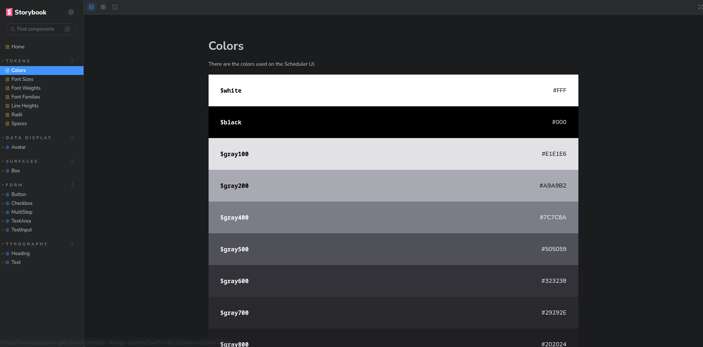

<p align="center">
  
</p>

<h3 align="center">
  Scheduler Design System
</h3>

<blockquote align="center">This is a Design System used for the Scheduler App that i'm building. It was made mainly to understand how the process of building the design system is done.</blockquote>
<br>

<a href="./LICENSE">
  
</a>

<a href="https://www.npmjs.com/package/@matheussartori/scheduler-design-system-react">
  
</a>

<a href="https://www.npmjs.com/package/@matheussartori/scheduler-design-system-tokens">
  
</a>

<p align="center">
  <a href="#installation">Installation</a><br>
  <a href="#about-the-project">About the project</a><br>
  <a href="#development">Development</a><br>
</p>

# Installation

To install the react components on your project, run the following command:

```bash
npm i @matheussartori/scheduler-design-system-react
```

If you want to install only the tokens, you can run:

```bash
npm i @matheussartori/scheduler-design-system-tokens
```

# About the project

On this design system, you will find different packages, since it's a monorepo.

It's using the turborepo package to mantain the builds and local servers working at the same time, and changesets to update the package versions.

The CI/CD includes the github pages deploy (Storybook) and the NPM packages update, when changed (combined with changeset).

- Tokens

The `tokens` package contains the colors, font families, font weights, spacings, and other tokens.

- React

The `react` package contains the react components.

- Docs

The `docs` package contains the storybook documentation.

- ESLint Config

The `eslint-config` package contains the common eslint settings, used within every package.

- Typescript Config

The `tsconfig` package contains the typescript config, used within every package.

# Development

To run everything locally, you need to install the node dependencies, and a node engine version 16 or above. To install the modules:

```bash
npm install
```

To start the local dev server, run:

```bash
npm run dev
```
